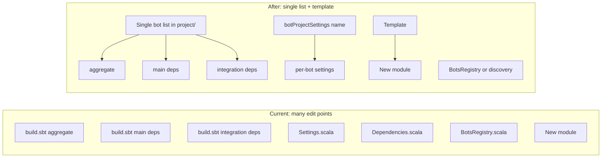

# Making bot addition easier and smoother

## Current situation

Adding a new bot today requires coordinated edits in **four places** plus creating the new module:

| Where                                                                                                 | What you do                                                                                                                     |
| ----------------------------------------------------------------------------------------------------- | ------------------------------------------------------------------------------------------------------------------------------- |
| [build.sbt](build.sbt)                                                                                | Add bot to `aggregate`, to `main.dependsOn`, to `integration.dependsOn`; add data-entry alias if needed                         |
| [project/Settings.scala](project/Settings.scala)                                                      | Add `XBotSettings` (name, deps, mainClass, Test resourceDirectory, assembly)                                                    |
| [project/Dependencies.scala](project/Dependencies.scala)                                              | Add `XBotDependencies = CommonDependencies`                                                                                     |
| [modules/main/.../BotsRegistry.scala](modules/main/src/main/scala/com/benkio/main/BotsRegistry.scala) | Add import(s), add `BotRegistryEntry(...)` to the list (and for bots with callbacks, pass `commandEffectfulCallback`)           |
| New module under `modules/bots/XBot/`                                                                 | Package, `XBot.scala` (sBotInfo), `XBotMainPolling.scala`, resources (`{id}_replies.json`, etc.), optional data-entry and tests |

Bot-specific Settings and Dependencies are **fully repetitive**: every bot uses `CommonDependencies` and the same pattern (name, mainClass `com.benkio.X.XMainPolling`, Test resourceDirectory, assembly). The only real variation is the bot id/name.

There is also a **bug** in [BotsRegistry.scala](modules/main/src/main/scala/com/benkio/main/BotsRegistry.scala): the extension `sBotWebhookResource` uses the imported `commandEffectfulCallback[IO]` (RichardPHJBensonBot’s) for every webhook bot instead of `botRegistryEntry.commandEffectfulCallback`. It should use the entry’s callback.

---

## Recommended improvements

### 1. Single list of bots in the build (high impact)

Define the list of bot projects **once** and derive aggregate, main deps, and integration deps from it.

- In [project/](project/) (e.g. a new `BotProjects.scala` or inside [Settings.scala](project/Settings.scala)), define something like:
  - `val botProjectNames: List[String] = List("CalandroBot", "ABarberoBot", "RichardPHJBensonBot", ...)`
- In [build.sbt](build.sbt):
  - Define each bot project as today (or via a small helper that takes name and path).
  - `aggregate` = `main + botDB + telegramBotInfrastructure + botProjects`
  - `main.dependsOn` = `telegramBotInfrastructure + botProjects`
  - `integration.dependsOn` = same pattern with bot projects from the list

This way, adding a bot = add one string to `botProjectNames` + define the project (or have a single place that maps name → Project). No more forgetting one of the three build.sbt touch points.

### 2. Shared bot Settings and Dependencies (high impact)

- In [project/Settings.scala](project/Settings.scala): add a single helper, e.g. `def botProjectSettings(projectName: String): Seq[Def.SettingsDefinition]`, that sets:
  - `name := projectName`
  - `libraryDependencies := CommonDependencies` (or a shared `BotDependencies` in Dependencies.scala)
  - `mainClass := Some(s"com.benkio.$projectName.${projectName}MainPolling")`
  - `Test / resourceDirectory := (Compile / resourceDirectory).value`
  - assembly settings
- Each bot project then uses: `.settings(Settings.settings ++ Settings.botProjectSettings("CalandroBot"): *)` (and no per-bot `CalandroBotSettings`).
- In [project/Dependencies.scala](project/Dependencies.scala): expose one `BotDependencies = CommonDependencies` (or keep `CommonDependencies`). Remove the six identical `XBotDependencies` vals.

Result: adding a bot no longer requires a new Settings block or a new Dependencies val.

### 4. Optional: registry from a shared trait (medium impact, more refactor)

To avoid editing [BotsRegistry.scala](modules/main/src/main/scala/com/benkio/main/BotsRegistry.scala) (and its imports) when adding a bot:

- Introduce a trait in **telegramBotInfrastructure** that every bot object implements, e.g. `trait RegisteredBot { def sBotInfo: SBotInfo; def commandEffectfulCallback[F[_]]: Map[String, Message => F[List[Text]]] }` (with default empty map).
- In **main**, build `BotRegistry.value` by **discovery** (e.g. at build time via a source generator that scans bot modules, or at runtime via reflection) so that any module that provides a `RegisteredBot` is included automatically.

Then adding a bot = add project + add to the single build list; no BotsRegistry edit. Downside: source generation or reflection adds complexity; build-time codegen is the cleaner option if you already use it elsewhere.

### 5. New-bot scaffold (medium impact)

- Add a **template** under e.g. `modules/bots/_template/` (or `scripts/templates/bot/`) with:
  - Standard layout: `src/main/scala/com/benkio/{{BotName}}/{{BotName}}.scala` (sBotInfo only), `{{BotName}}MainPolling.scala`, `src/main/resources/` with placeholder `{id}_replies.json` and `{id}_commands.json`.
  - Optional: `docs/adding-a-bot.md` with step-by-step instructions that reference the template and the single list (and, if present, the trait/discovery).
- Optionally an **sbt task** (e.g. `sbt newBot BotName`) that copies the template and substitutes the bot name/id, and optionally appends to the bot list and creates the project definition (if not fully derivable from the list).

This makes the “create new module” step a copy-paste or one command instead of re-creating from memory.

### 6. Data-entry aliases (low priority)

Data-entry aliases in [build.sbt](build.sbt) are per-bot and manual. Options:

- Leave as-is (only a few bots have data entry), or
- Add a convention: “if project `X` has a runnable `com.benkio.X.XMainDataEntry`, add alias `xAddData`.” That can be implemented by a small sbt task that discovers such main classes and builds aliases, or by a single list (e.g. `dataEntryBots: List[String]`) used to generate the aliases.

---

## Suggested order of work

1. **Fix the webhook callback bug** in BotsRegistry (quick, correct behavior).
2. **Introduce shared bot Settings + single BotDependencies** so new bots don’t add new Settings/Dependencies blocks.
3. **Introduce the single list of bot names** and derive aggregate and dependsOn in build.sbt.
4. **Add a template and short doc** (e.g. `docs/adding-a-bot.md`) so adding a bot is “add to list, create module from template, add one registry entry” (or “add to list, create module from template” if you do discovery).
5. **Optionally** implement discovery/trait so BotsRegistry is never edited when adding a bot, and **optionally** add an sbt `newBot` task that uses the template and list.

---

## Summary diagram

After the refactor, adding a bot would be: (1) add the bot name to the single list and define one project that uses `botProjectSettings(name)`; (2) create the module from the template (or sbt task); (3) add one entry to BotsRegistry—or omit (3) if discovery is implemented.
